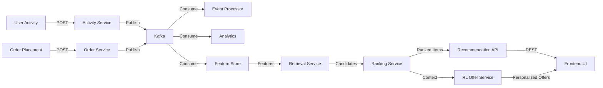

# 🎯 RetargetIQ

<div align="center">


**Real-Time Event-Driven Retargeting Engine**

*Inspired by production architectures at Netflix, LinkedIn, and Uber*

[](https://openjdk.java.net/)
[](https://spring.io/projects/spring-boot)
[](https://kafka.apache.org/)
[](https://www.docker.com/)

[Overview](#-what-is-retargetiq) •
[Architecture](#-architecture) •
[Quick Start](#-quick-start) •
[Services](#-microservices-breakdown) •
[Demo](#-see-it-in-action)

</div>

---

## 🌟 What is RetargetIQ?

RetargetIQ is a **learning-focused, event-driven microservices platform** that demonstrates how modern tech giants process millions of user interactions in real-time. Built on Apache Kafka, it simulates a complete retargeting ecosystem where user behavior flows through independent services that react, analyze, and personalize in milliseconds.

### 💡 The Problem It Solves

Imagine you're Amazon. A user:
1. Views a laptop 🖥️
2. Clicks on accessories 🖱️
3. Abandons the cart 🛒
4. Returns 3 days later 🔄

**How do you show them the perfect recommendation?**

RetargetIQ demonstrates the architecture that powers this magic ✨

---

## 🏗️ Architecture

### The Event-Driven Flow



### 🎭 Design Philosophy

| Principle | Implementation |
|-----------|---------------|
| **Decoupling** | Services communicate via events, not direct calls |
| **Scalability** | Each microservice scales independently |
| **Fault Tolerance** | If one consumer fails, others keep processing |
| **Event Sourcing** | All actions stored as immutable events in Kafka |
| **Real-Time** | Sub-100ms latency from event to recommendation |

---

## 🚀 Quick Start

### Prerequisites

- Docker & Docker Compose installed
- 8GB RAM minimum
- Ports 8081-8090, 9092, 2181 available

### Launch the Entire System

```bash
# Clone the repository
git clone https://github.com/theparidhisharma/RetargetIQ.git
cd RetargetIQ

# Start all services with one command
docker-compose up --build

# Watch the magic happen 🎩✨
# Kafka, Zookeeper, and all 10 microservices will spin up
```

### Verify Services are Running

```bash
# Check all containers
docker ps

# You should see:
# - zookeeper
# - kafka
# - user-activity-service
# - order-service
# - event-processor-service
# - analytics-service
# - feature-store-service
# - retrieval-service
# - ranking-service
# - recommend-api-service
# - rl-offer-service
# - frontend-ui
```

---

## 🎮 See It in Action

### 1️⃣ Trigger a User Activity Event

```bash
curl -X POST http://localhost:8081/api/users/activity \
  -H "Content-Type: application/json" \
  -d '{
    "userId": "user_42",
    "eventType": "VIEW",
    "productId": "laptop_pro_2024",
    "sessionId": "session_xyz",
    "timestamp": 1705593600000
  }'
```

**What Happens?**
- 📤 Event published to `user-activity-topic`
- 🔍 Event Processor validates & enriches
- 📊 Analytics increments view counter
- 🧠 Feature Store updates user profile
- 🎯 Retrieval finds similar products
- 🏆 Ranking scores candidates
- 💎 Recommendations served via API

### 2️⃣ Place an Order

```bash
curl -X POST http://localhost:8082/api/orders/place \
  -H "Content-Type: application/json" \
  -d '{
    "orderId": "order_789",
    "userId": "user_42",
    "items": [
      {
        "productId": "laptop_pro_2024",
        "quantity": 1,
        "price": 1299.99
      }
    ],
    "totalAmount": 1299.99
  }'
```

**What Happens?**
- 📤 Order event flows through Kafka
- 📈 Analytics updates conversion metrics
- 🎁 RL Offer Service personalizes next offer
- 🔮 Feature Store marks user as "high-value"

### 3️⃣ View the Logs

```bash
# Watch events being processed in real-time
docker logs -f event-processor-service

# See analytics aggregations
docker logs -f analytics-service

# Check recommendation generation
docker logs -f ranking-service
```

---

## 🏢 Microservices Breakdown

<table>
<tr>
<td width="50%" valign="top">

### 🚦 **User Activity Service**
**Port:** `8081`  
**Role:** Event Generator

Captures every user interaction:
- Product views 👁️
- Button clicks 🖱️
- Page scrolls 📜
- Time on page ⏱️

**Kafka Topic:** `user-activity-topic`

```java
@PostMapping("/api/users/activity")
public ResponseEntity<String> logActivity(
    @RequestBody UserActivity activity
) {
    kafkaTemplate.send(
        "user-activity-topic", 
        activity
    );
    return ResponseEntity.ok("Tracked!");
}
```

</td>
<td width="50%" valign="top">

### 🛒 **Order Service**
**Port:** `8082`  
**Role:** Transaction Publisher

Handles order events:
- Cart additions 🛍️
- Checkouts 💳
- Order completions ✅
- Cancellations ❌

**Kafka Topic:** `order-topic`

```java
@PostMapping("/api/orders/place")
public ResponseEntity<String> placeOrder(
    @RequestBody Order order
) {
    kafkaTemplate.send(
        "order-topic", 
        order
    );
    return ResponseEntity.ok("Ordered!");
}
```

</td>
</tr>

<tr>
<td width="50%" valign="top">

### ⚙️ **Event Processor Service**
**Port:** `8083`  
**Role:** Central Processing Unit

The data janitor:
- ✅ Validates event schemas
- 🔧 Enriches with metadata
- 🌍 Adds geolocation
- 🤖 Filters bot traffic
- 📝 Standardizes formats

```java
@KafkaListener(topics = "user-activity-topic")
public void processEvent(String event) {
    // Validate
    if (!isValid(event)) return;
    
    // Enrich
    EnrichedEvent enriched = enrich(event);
    
    // Republish
    kafkaTemplate.send(
        "processed-events", 
        enriched
    );
}
```

</td>
<td width="50%" valign="top">

### 📊 **Analytics Service**
**Port:** `8084`  
**Role:** Metrics Aggregator

Real-time dashboards:
- 📈 Conversion funnels
- 🔥 Trending products
- 👥 User cohort analysis
- 💰 Revenue tracking

**Metrics Computed:**
```
- views_per_minute
- cart_abandonment_rate
- average_order_value
- top_products_by_category
```

</td>
</tr>

<tr>
<td width="50%" valign="top">

### 🧠 **Feature Store Service**
**Port:** `8085`  
**Role:** ML Feature Engine

Computes user features:
```json
{
  "userId": "user_42",
  "features": {
    "views_7d": 127,
    "purchases_30d": 4,
    "avg_session_sec": 340,
    "fav_categories": ["tech", "books"],
    "price_sensitivity": 0.72,
    "last_active": "2025-01-18T10:30:00Z"
  }
}
```

**Why It Matters:**  
ML models need fresh features. This service ensures predictions stay accurate.

</td>
<td width="50%" valign="top">

### 🔍 **Retrieval Service**
**Port:** `8086`  
**Role:** Candidate Generator

**Stage 1 of Recommendations**

Fetches ~1000 candidates using:
- Collaborative filtering
- Content similarity
- Popularity trends
- User history

**Speed:** < 50ms ⚡

```java
List<Product> candidates = 
    retrieveSimilarProducts(userHistory)
    .limit(1000);
```

</td>
</tr>

<tr>
<td width="50%" valign="top">

### 🏆 **Ranking Service**
**Port:** `8087`  
**Role:** Recommendation Scorer

**Stage 2 of Recommendations**

Ranks candidates by score:
```
Score = 0.4 × user_pref
      + 0.3 × item_quality  
      + 0.2 × recency
      + 0.1 × diversity
```

**Output:** Top 20 items per user

**Latency:** < 100ms ⚡

</td>
<td width="50%" valign="top">

### 🎯 **Recommendation API**
**Port:** `8088`  
**Role:** Client-Facing Service

Serves recommendations via REST:

```bash
GET /api/recommendations/user_42
```

**Response:**
```json
{
  "userId": "user_42",
  "recommendations": [
    {
      "productId": "laptop_pro_2024",
      "score": 0.94,
      "reason": "Based on your views"
    }
  ]
}
```

</td>
</tr>

<tr>
<td width="50%" valign="top">

### 🎰 **RL Offer Service**
**Port:** `8089`  
**Role:** Smart Offer Engine

Uses reinforcement learning principles:

**Epsilon-Greedy Strategy:**
- 90% exploit (best offer)
- 10% explore (learn new offers)

**Offers Generated:**
- Discount codes 🎟️
- Free shipping 📦
- Bundle deals 🎁
- Flash sales ⚡

</td>
<td width="50%" valign="top">

### 🖥️ **Frontend UI**
**Port:** `3000`  
**Role:** Visualization Dashboard

Interactive interface showing:
- Live event stream 📡
- Real-time recommendations 🎯
- Analytics charts 📊
- System health 💚

**Built With:** React + Tailwind CSS

</td>
</tr>
</table>

---

## 🔄 Data Flow Example

Let's trace a complete user journey:

```
┌─────────────────────────────────────────────────────────────────┐
│ USER VIEWS LAPTOP                                               │
└─────────────────────────────────────────────────────────────────┘
                           ↓
┌─────────────────────────────────────────────────────────────────┐
│ Frontend → User Activity Service                                │
│ POST /api/users/activity                                        │
└─────────────────────────────────────────────────────────────────┘
                           ↓
┌─────────────────────────────────────────────────────────────────┐
│ Kafka Topic: user-activity-topic                                │
│ { userId: "user_42", action: "VIEW", product: "laptop" }        │
└─────────────────────────────────────────────────────────────────┘
                           ↓
              ┌────────────┴────────────┐
              ↓                         ↓
    ┌──────────────────┐      ┌──────────────────┐
    │ Event Processor  │      │ Analytics        │
    │ ✓ Validates      │      │ ++ view_count    │
    │ ✓ Enriches       │      │ Update trending  │
    └──────────────────┘      └──────────────────┘
              ↓                         ↓
    ┌──────────────────┐      ┌──────────────────┐
    │ Feature Store    │      │ Retrieval        │
    │ Update:          │      │ Find similar:    │
    │ views_7d += 1    │      │ - laptop_air     │
    │ last_viewed      │      │ - laptop_gaming  │
    └──────────────────┘      └──────────────────┘
                                       ↓
                              ┌──────────────────┐
                              │ Ranking          │
                              │ Score & sort     │
                              │ top 20 items     │
                              └──────────────────┘
                                       ↓
                              ┌──────────────────┐
                              │ Recommendation   │
                              │ API              │
                              │ Cache in Redis   │
                              └──────────────────┘
                                       ↓
                              ┌──────────────────┐
                              │ Frontend UI      │
                              │ Display recs     │
                              └──────────────────┘

⏱️ Total Time: 50-200ms
```

---

## 📚 Tech Stack

<table>
<tr>
<td align="center" width="20%">

<br><strong>Java 17</strong>
<br>Modern LTS
</td>
<td align="center" width="20%">

<br><strong>Spring Boot</strong>
<br>Microservices
</td>
<td align="center" width="20%">

<br><strong>Kafka</strong>
<br>Event Streaming
</td>
<td align="center" width="20%">

<br><strong>Docker</strong>
<br>Containerization
</td>
<td align="center" width="20%">

<br><strong>React</strong>
<br>Frontend
</td>
</tr>
</table>

### Full Stack

```yaml
Backend:
  - Java 17 (LTS)
  - Spring Boot 3.x
  - Spring Kafka
  - Lombok
  - SLF4J

Messaging:
  - Apache Kafka
  - Zookeeper

Infrastructure:
  - Docker
  - Docker Compose

Build:
  - Maven
  - Multi-module project

Frontend:
  - React
  - Tailwind CSS
  - Axios
```

---

## 🎓 What You'll Learn

Building and exploring RetargetIQ teaches:

### 1. **Event-Driven Architecture**
- How to decouple services
- Async communication patterns
- Event sourcing principles

### 2. **Apache Kafka Mastery**
- Topics and partitions
- Producers and consumers
- Consumer groups
- Offset management

### 3. **Microservices Design**
- Single Responsibility Principle
- Service boundaries
- Independent deployment
- Fault isolation

### 4. **Recommendation Systems**
- Retrieval → Ranking pipeline
- Feature engineering
- Real-time ML serving

### 5. **Scalability Patterns**
- Horizontal scaling
- Stateless services
- Caching strategies
- Load distribution

### 6. **Real-World Architecture**
- How Netflix recommends shows
- How Uber processes rides
- How LinkedIn suggests connections

---

## 🔬 Advanced Topics

### Kafka Deep Dive

**Topic Configuration:**
```bash
# Create topic with 3 partitions
kafka-topics --create \
  --topic user-activity-topic \
  --partitions 3 \
  --replication-factor 1
```

**Consumer Groups:**
```java
@KafkaListener(
    topics = "user-activity-topic",
    groupId = "analytics-group"
)
```

**Why 3 Partitions?**
- Enables 3 parallel consumers
- Distributes load evenly
- Maintains order within partition

### Scaling Strategy

| Service | Scaling Method | Bottleneck |
|---------|---------------|------------|
| User Activity | Horizontal | Network I/O |
| Kafka | Add partitions | Disk I/O |
| Analytics | Consumer groups | CPU |
| Feature Store | Sharding | Memory |
| Ranking | Horizontal | CPU |

---

## 🚧 Production Enhancements

To make this production-ready, add:

### ✅ Persistence Layer
```yaml
Add:
  - MongoDB (user profiles, products)
  - PostgreSQL (transactional data)
  - Redis (caching, feature store)
  - Cassandra (time-series metrics)
```

### ✅ Reliability
```yaml
Implement:
  - Dead Letter Queues
  - Exponential backoff retry
  - Circuit breakers
  - Health checks
  - Graceful shutdown
```

### ✅ Security
```yaml
Add:
  - OAuth 2.0 / JWT auth
  - Kafka SSL/SASL
  - API rate limiting
  - Input validation
  - Secrets management
```

### ✅ Observability
```yaml
Integrate:
  - Prometheus (metrics)
  - Grafana (dashboards)
  - ELK Stack (logging)
  - Jaeger (tracing)
  - Kafka Manager
```

### ✅ Testing
```yaml
Write:
  - Unit tests (JUnit 5)
  - Integration tests (Testcontainers)
  - E2E tests (REST Assured)
  - Load tests (JMeter)
  - Contract tests (Pact)
```

### ✅ Deployment
```yaml
Migrate to:
  - Kubernetes (orchestration)
  - Helm charts (packaging)
  - ArgoCD (GitOps)
  - CI/CD (GitHub Actions)
  - Blue-green deployments
```

---

## 🎯 Real-World Comparisons

### Netflix
> RetargetIQ's retrieval + ranking mirrors Netflix's recommendation engine that suggests what to watch next.

**Similarities:**
- Event-driven user activity tracking
- Two-stage recommendation (retrieval + ranking)
- Feature store for user preferences

### Uber
> The event processing pipeline is similar to how Uber tracks ride states and driver locations in real-time.

**Similarities:**
- Kafka for event streaming
- Microservices architecture
- Sub-second latency requirements

### LinkedIn
> LinkedIn pioneered Kafka. RetargetIQ uses similar patterns for "People You May Know" recommendations.

**Similarities:**
- Graph-based retrieval
- Real-time feature updates
- Personalized content ranking

---

## 📖 Documentation

### Project Structure
```
RetargetIQ/
├── user-activity-service/
│   ├── src/main/java/
│   ├── Dockerfile
│   └── pom.xml
├── order-service/
├── event-processor-service/
├── analytics-service/
├── feature-store-service/
├── retrieval-service/
├── ranking-service/
├── recommend-api-service/
├── rl-offer-service/
├── frontend-ui/
├── docker-compose.yml
└── README.md
```

### Environment Variables
```bash
# Kafka Configuration
KAFKA_BOOTSTRAP_SERVERS=localhost:9092
KAFKA_GROUP_ID=retarget-iq

# Service Ports
USER_ACTIVITY_PORT=8081
ORDER_SERVICE_PORT=8082
# ... etc
```

---

## 🐛 Troubleshooting

### Kafka Not Starting?
```bash
# Check if port 9092 is in use
lsof -i :9092

# Restart Kafka
docker-compose restart kafka
```

### Service Can't Connect to Kafka?
```bash
# Verify Kafka is accessible
docker exec -it kafka kafka-topics --list \
  --bootstrap-server localhost:9092
```

### Out of Memory?
```bash
# Allocate more memory to Docker
# Docker Desktop → Settings → Resources → Memory: 8GB
```

---

## 🤝 Contributing

Contributions welcome! Here's how:

1. Fork the repository
2. Create a feature branch: `git checkout -b feature/amazing-feature`
3. Commit changes: `git commit -m 'Add amazing feature'`
4. Push to branch: `git push origin feature/amazing-feature`
5. Open a Pull Request

### Areas for Contribution
- [ ] Add persistence layer (MongoDB/PostgreSQL)
- [ ] Implement actual ML models
- [ ] Add monitoring dashboards
- [ ] Write comprehensive tests
- [ ] Improve frontend UI
- [ ] Add Kubernetes deployment
- [ ] Create Helm charts
- [ ] Add API documentation (Swagger)

---

## 📝 License

This project is open source and available under the [MIT License](LICENSE).

---

## 👤 Author

**Paridhi Sharma**

🎓 B.Tech (2nd Year) – IGDTUW  
💼 Former Backend Engineering Intern – Deutsche Telekom Digital Labs

- GitHub: [@theparidhisharma](https://github.com/theparidhisharma)
- LinkedIn: [theparidhisharma](https://www.linkedin.com/in/theparidhisharma)
- Email: paridhi0203sharmaaa@gmail.com

---

## 🙏 Acknowledgments

- **Inspiration:** Netflix, LinkedIn, Uber engineering blogs
- **Learning Resources:** 
  - Martin Kleppmann's "Designing Data-Intensive Applications"
  - Kafka: The Definitive Guide
  - Spring Boot documentation
- **Mentorship:** Deutsche Telekom Digital Labs team

---

## ⭐ Show Your Support

If this project helped you learn something new, give it a ⭐️!

---

<div align="center">

**Built with ❤️ and ☕ by Paridhi Sharma**

*Learning by building. One microservice at a time.*

</div>
